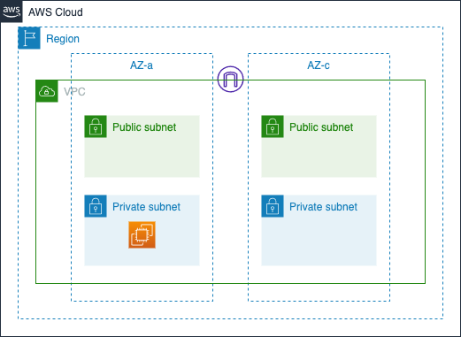
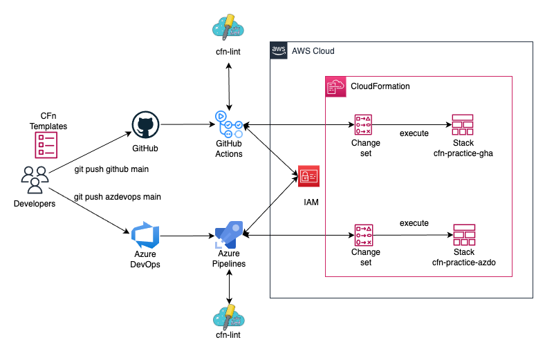

# cfn-practice

[](https://github.com/kanare-dev/cfn-practice/actions/workflows/deploy.yml)

CloudFormation を使った IaC の CI/CD を、**GitHub Actions** と **Azure DevOps** の両方で比較検証するための個人用プロジェクトです。

---

## 目的

同じ CloudFormation テンプレートを 2 つの CI/CD プラットフォームからデプロイし、以下の観点で実務に近い運用を体験・比較します。

| 観点 | 内容 |
|------|------|
| **変更の見える化** | デプロイ前に Change Set で差分を確認 |
| **安全な反映** | 意図しない変更を防ぐゲート |
| **失敗時の回復** | ログによる原因調査・自動ロールバック・再デプロイ |
| **プラットフォーム比較** | 設定方法・YAML 構文・シークレット管理の違いを記録 |

---

## AWS 構成

検証に必要な要素に絞ったシンプルな構成です（合計 14 リソース）。



```
ap-northeast-1 (東京)
└── VPC (10.0.0.0/16)
    ├── Public Subnet AZ-a  (10.0.1.0/24)
    ├── Public Subnet AZ-c  (10.0.2.0/24)
    ├── Private Subnet AZ-a (10.0.11.0/24) ← EC2 をここに配置
    └── Private Subnet AZ-c (10.0.12.0/24)
```

- Internet Gateway（Public Subnet 向け）
- EC2 インスタンス（t3.micro / Amazon Linux 2023、Private Subnet 内）
- NAT Gateway なし（コスト削減のため）

---

## CI/CD パイプライン構成



```
コードの push
    │
    ├─→ [GitHub Actions]   cfn-practice-gha スタックをデプロイ
    └─→ [Azure Pipelines]  cfn-practice-azdo スタックをデプロイ
```

両パイプラインは同じロジックで動作します。

```
1. cfn-lint でテンプレートを検証
2. aws cloudformation validate-template で構文確認
3. Change Set を作成
4. Change Set の内容をログに出力（追加・変更・削除リソースを一覧表示）
5. 変更がなければそのまま正常終了（空 Change Set の検出）
6. Change Set を実行してスタックを更新
7. 失敗時はスタックイベントをログに出力して原因を示す
```

---

## リモートリポジトリ

| プラットフォーム | URL |
|----------------|-----|
| GitHub | https://github.com/kanare-dev/cfn-practice |
| Azure DevOps | https://dev.azure.com/kanare-org/cfn-practice |

---

## ディレクトリ構成

```
cfn-practice/
├── cfn/
│   └── template.yaml          # CloudFormation テンプレート（両パイプライン共通）
├── scripts/
│   └── pipeline/
│       └── deploy.sh          # デプロイロジック（両パイプラインから呼び出し）
├── .github/
│   └── workflows/
│       └── deploy.yml         # GitHub Actions パイプライン定義
├── .azure/
│   └── pipelines/
│       └── deploy.yml         # Azure Pipelines 定義
├── .cfnlintrc.yaml            # cfn-lint 設定
├── specs/
│   └── 001-cfn-cicd-compare/  # 設計ドキュメント
│       ├── spec.md            # 要件定義
│       ├── plan.md            # 実装計画
│       ├── research.md        # 技術調査・意思決定記録
│       ├── data-model.md      # CF テンプレート構造・パイプライン設計
│       ├── quickstart.md      # セットアップ手順
│       └── contracts/         # パラメータ・シークレット仕様
└── README.md
```

---

## セットアップ

初回セットアップの詳細手順は [`specs/001-cfn-cicd-compare/quickstart.md`](specs/001-cfn-cicd-compare/quickstart.md) を参照してください。

**概要**:

1. AWS で CI/CD 用 IAM ユーザーを作成（EC2・VPC・CloudFormation 権限）
2. GitHub Secrets に `AWS_ACCESS_KEY_ID` / `AWS_SECRET_ACCESS_KEY` / `AWS_REGION` を登録
3. Azure DevOps の Library に Variable Group `cfn-practice-secrets` を作成して同じ値を登録
4. `main` ブランチへ push → 両パイプラインが自動起動

---

## 必要なツール（ローカル確認用）

| ツール | 用途 |
|--------|------|
| AWS CLI v2 | スタック状態の手動確認・クリーンアップ |
| cfn-lint | テンプレートのローカル検証 |

---

## コスト目安

| リソース | 料金 |
|---------|------|
| EC2 t3.micro × 2 スタック | 約 ¥3〜4 / 日 |
| VPC・Subnet・IGW | 無料 |
| **合計** | **検証中のみ起動を推奨** |

使用後はスタックを削除してください：

```bash
aws cloudformation delete-stack --stack-name cfn-practice-gha --region ap-northeast-1
aws cloudformation delete-stack --stack-name cfn-practice-azdo --region ap-northeast-1
```

---

## 開発ワークフロー

本プロジェクトは [speckit](https://github.com/speckit) を使った仕様駆動開発で進めています。

```
/speckit.specify  → 要件定義
/speckit.plan     → 実装計画
/speckit.tasks    → タスクリスト生成
/speckit.implement → 実装
/speckit.analyze  → 整合性チェック
```
